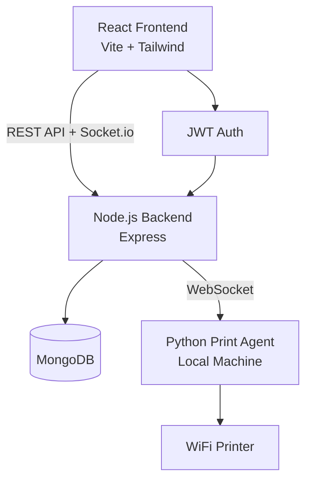

# Cloud Printing System — Full-Stack Implementation Plan

## Overview

A production-ready cloud printing SaaS platform where users upload documents from anywhere and a local Python agent near a WiFi printer picks them up and prints them in real time.

---

## Architecture Diagram



---

## Folder Structure

```
cloud-printing/
├── frontend/                    # React + Vite + Tailwind
│   ├── src/
│   │   ├── components/          # Reusable UI components
│   │   ├── pages/               # Route-level pages
│   │   ├── hooks/               # Custom React hooks
│   │   ├── context/             # Auth, Theme, Socket context
│   │   ├── services/            # API service layer
│   │   ├── utils/               # Helpers
│   │   └── assets/              # Images, icons
│   ├── .env
│   └── vite.config.js
│
├── backend/                     # Node.js + Express
│   ├── src/
│   │   ├── controllers/         # Route handlers
│   │   ├── middleware/          # Auth, upload, validation
│   │   ├── models/              # Mongoose schemas
│   │   ├── routes/              # API routes
│   │   ├── services/            # Business logic
│   │   ├── socket/              # Socket.io handlers
│   │   └── utils/               # Helpers, mailer
│   ├── uploads/                 # Stored files
│   ├── .env
│   └── server.js
│
├── print-agent/                 # Python agent
│   ├── agent.py                 # Main agent script
│   ├── printer_manager.py       # Windows print logic
│   ├── config.py                # Config
│   └── requirements.txt
│
├── docker-compose.yml
├── .dockerignore
└── README.md
```

---

## Proposed Changes

### 1. Backend — Node.js + Express

#### [NEW] `backend/server.js`
- Express app setup, Socket.io init, MongoDB connect, middleware chain

#### [NEW] `backend/src/models/User.js`
- Schema: name, email, passwordHash, role (user/admin), avatar, createdAt, isActive

#### [NEW] `backend/src/models/Printer.js`
- Schema: name, location, ipAddress, status (online/offline), agentId, capabilities

#### [NEW] `backend/src/models/PrintJob.js`
- Schema: fileUrl, fileName, fileSize, userId, printerId, status, copies, paperSize, timestamp, retries

#### [NEW] `backend/src/models/ActivityLog.js`
- Schema: userId, action, details, timestamp, level (info/warn/error)

#### [NEW] `backend/src/routes/`
- `auth.routes.js` — register, login, forgot-password, refresh-token
- `user.routes.js` — profile, update, list (admin)
- `printer.routes.js` — CRUD, status, assign agent
- `printjob.routes.js` — create, list, cancel, retry, download report
- `admin.routes.js` — analytics, activity logs, server status

#### [NEW] `backend/src/middleware/`
- `auth.middleware.js` — JWT verify, role check
- `upload.middleware.js` — Multer config (PDF, images, docs)
- `validate.middleware.js` — Joi/express-validator schemas
- `error.middleware.js` — Global error handler

#### [NEW] `backend/src/socket/handlers.js`
- Print job status events, printer ping/pong, agent registration

---

### 2. Frontend — React + Vite + Tailwind

#### Pages
- `LandingPage` — Hero, Features, How It Works, Pricing, Testimonials, CTA, Footer
- `LoginPage` / `RegisterPage` / `ForgotPasswordPage`
- `DashboardPage` — Upload, Queue, History, Printer Status
- `AdminDashboardPage` — Users, Printers, Jobs, Analytics, Logs

#### Key Components
- `FileUploader` — Drag-and-drop with progress, preview
- `PrintQueue` — Real-time table with status badges
- `PrinterCard` — Online/offline indicator, manage actions
- `AnalyticsChart` — Recharts-based stats
- `Sidebar` — Collapsible nav with dark/light toggle
- `NotificationToast` — Push notification system

#### Context / State
- `AuthContext` — JWT token, user state, login/logout
- `ThemeContext` — Dark/light mode persisted to localStorage
- `SocketContext` — Socket.io connection, event subscriptions

---

### 3. Python Print Agent

#### [NEW] `print-agent/agent.py`
- WebSocket connection to backend, job polling fallback
- Auth with agent token, job download, status update

#### [NEW] `print-agent/printer_manager.py`
- Windows printing via `win32print` / `win32api`
- PDF printing via Ghostscript fallback
- Image printing support

---

### 4. Docker & Deployment

#### [NEW] `docker-compose.yml`
- Services: `mongodb`, `backend`, `frontend` (nginx)
- Volume mounts for uploads and DB persistence

#### [NEW] `backend/Dockerfile` + `frontend/Dockerfile`

#### [NEW] `README.md`
- Full installation guide, env variables, how to run agent

---

## Verification Plan

### Automated
- Start backend: `npm run dev` — verify API health endpoint
- Start frontend: `npm run dev` — verify Vite dev server loads
- Run `curl` against auth endpoints to verify JWT flow

### Manual
- Register user → login → upload a PDF → verify it appears in queue
- Check Socket.io event fires when job status changes
- Verify admin dashboard shows analytics cards
- Verify dark/light mode toggle persists
- Verify Python agent connects and picks up jobs (unit-testable without real printer)

---

## Open Questions

> [!IMPORTANT]
> No blocking questions — all requirements are well-specified. Proceeding with sensible defaults:
> - MongoDB: local by default, Atlas URI via env var
> - Default paper size: A4
> - Agent auth: dedicated `AGENT_SECRET` env var
> - Email provider: nodemailer + SMTP env vars (Gmail-compatible)
> - File storage: local `uploads/` directory (S3 path via env var stub included)
